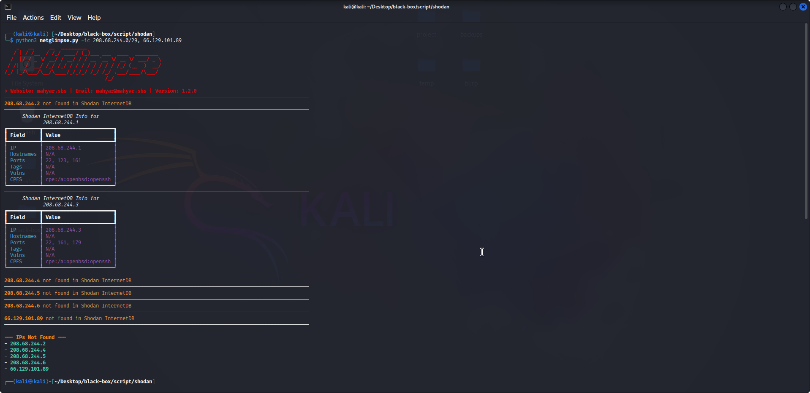
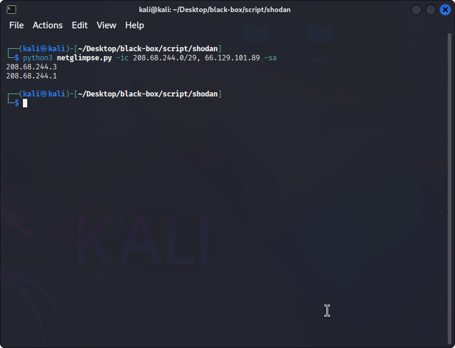
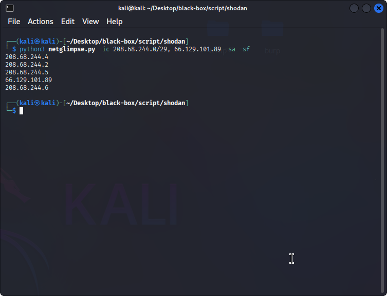

# NetGlimpse

```
  _   _      _   _     _ _
 | \ | | ___| |_| |__ (_) | ___ _ __
 |  \| |/ _ \ __| '_ \| | |/ _ \ '__|
 | |\  |  __/ |_| | | | | |  __/ |
 |_| \_|\___|\__|_| |_|_|_|\___|_|

> Website: mahyar.sbs | Email: mahyar@mahyar.sbs | Version: 1.2.0
```

**A fast, colorful, and flexible Python tool to query single IP addresses or CIDR ranges against Shodan's InternetDB.**

[](https://www.python.org/)
[](https://opensource.org/licenses/MIT)
[](https://www.python.org/)

---

NetGlimpse provides a clean command-line interface to quickly get reconnaissance data from Shodan's free **InternetDB API**. Designed for security researchers, penetration testers, and network administrators who need to check hosts for open ports, vulnerabilities, and other metadata **without** the need for an API key.

---

## ✨ Features

- **Combined Input**: Check single IPs and entire CIDR ranges in a single command or multiple tokens.
- **Threaded Requests**: Fast scanning with `-t/--thread` (default `5`, max `50`) using a thread pool.
- **Rich & Colorful Output**: Beautiful tables via `rich`; clean separators between sections.
- **Flexible Silence Modes**: Tailor the output—only found IPs, suppress “not found”, or output just not-found IPs.
- **Randomized User-Agent**: Uses `fake-useragent` with fallback UA for robustness.
- **Cross-Platform**: Works on Linux, Windows, and macOS.
- **No API Key Required**: Uses the public InternetDB endpoint.

---

## 📁 Project Structure

```
netglimpse/
├─ netglimpse.py          # main CLI script
├─ requirements.txt       # pinned dependencies
├─ README.md              # documentation
└─ gallery/               # screenshots and output samples (add images here)
```

---

## ⚙️ Installation

**Requirements:** Python 3.8+

**1) Clone the repository**
```bash
git clone https://github.com/your-username/netglimpse.git
cd netglimpse
```

**2) Create a virtual environment (recommended)**
- Linux/macOS:
```bash
python3 -m venv env
source env/bin/activate
```

- Windows (PowerShell):
```powershell
py -3 -m venv env
.\env\Scripts\Activate.ps1
```

**3) Install dependencies**
```bash
pip install -r requirements.txt
```

---

## 🚀 Usage

The script is controlled via command-line arguments. The primary argument is `-ic` / `--ip-cidr` which **accepts multiple tokens** and **comma-separated lists** with or without spaces.

> All of the following are valid:
>
> - `-ic 8.8.8.8,1.1.1.0/30,9.9.9.9`
> - `-ic 103.4.197.120/29, 208.68.244.0/22`
> - `-ic 103.4.197.120/29, 208.68.244.0/22 1.2.3.4`
> - `-ic "103.4.197.120/29, 208.68.244.0/22"`

### Command-Line Arguments

| Switch | Argument | Description |
|-------|----------|-------------|
| `-ic`, `--ip-cidr` | `<targets...>` | **(Required)** One or more targets. Each token may be a single IP, a CIDR, or a comma-separated list. |
| `-t`, `--thread` | `1-50` | Thread count for parallel queries. Default `5`, maximum `50`. |
| `-d`, `--delay` | seconds | Delay before each request (per thread). Useful to be gentle with the service. Default `0.0`. |
| `-sa`, `--silent-all` | — | **Silent All:** Output **only** the IPs found in Shodan, one per line. No banners/tables. |
| `-snf`, `--silent-not-found` | — | **Silent Not Found:** Suppress output for IPs not found. Show banner and tables for found IPs. |
| `-sf`, `--silent-found` | — | **Silent Found:** Suppress output for IPs found. Show banner and a **grouped** list of IPs **not** found. |
| `-h`, `--help` | — | Display built-in help. |

**Combination Rules**
- The three silent switches cannot be used together.
- `-sa` **and** `-snf` → equivalent to **`-sa`**.
- `-sa` **and** `-sf`  → output **only** not-found IPs (one per line), **no** banners/logs.

---

## 💡 Examples

### 1) Standard scan (tables + grouped not-found summary)
```bash
python3 netglimpse.py -ic 8.8.8.8,1.1.1.0/30
```

**Sample Output (truncated):**
```
  _   _      _   _     _ _
 | \ | | ___| |_| |__ (_) | ___ _ __
 |  \| |/ _ \ __| '_ \| | |/ _ \ '__|
 | |\  |  __/ |_| | | | | |  __/ |
 |_| \_|\___|\__|_| |_|_|_|\___|_|
> Website: mahyar.sbs | Email: mahyar@mahyar.sbs | Version: 1.2.0
────────────────────────────────────────────────────────────────────
┏━━━━━━━━━━━━━━━━━━━━━━━━━━━━━━━━━━━━━━━━━━━━━━━━━━━━━━━━━━━━━━━━━━━┓
┃               Shodan InternetDB Info for 8.8.8.8                 ┃
┡━━━━━━━━━━━━━━━━━━━━━━━━━━━━━━━━━━━━━━━━━━━━━━━━━━━━━━━━━━━━━━━━━━━┩
│ Field     │ Value                                                │
├───────────┼──────────────────────────────────────────────────────┤
│ IP        │ 8.8.8.8                                              │
│ Hostnames │ dns.google                                           │
│ Ports     │ 53, 443                                              │
│ Tags      │ N/A                                                  │
│ Vulns     │ N/A                                                  │
│ CPES      │ N/A                                                  │
└───────────┴──────────────────────────────────────────────────────┘
────────────────────────────────────────────────────────────────────

--- IPs Not Found ---
- 1.1.1.2
```

### 2) Threaded scan (faster lookups)
```bash
python3 netglimpse.py -ic 8.8.8.8,1.1.1.0/28 -t 20
```

### 3) Silent All (found IPs only; clean list)
```bash
python3 netglimpse.py -ic 8.8.8.8,1.2.3.4,1.1.1.1 -sa
```

**Sample Output:**
```
8.8.8.8
1.1.1.1
```

### 4) Silent Not Found (hide noise; show only found tables)
```bash
python3 netglimpse.py -ic 194.73.181.176/28 -snf
```

### 5) Silent Found (grouped not-found list with banner)
```bash
python3 netglimpse.py -ic 208.68.244.0/29 -sf
```

**Sample Output:**
```
--- IPs Not Found ---
- 208.68.244.5
- 208.68.244.4
- 208.68.244.2
- 208.68.244.6
```

### 6) Combination: `-sa` + `-sf` (not-found only, no banner/logs)
```bash
python3 netglimpse.py -ic 203.0.113.0/30 -sa -sf
```

**Sample Output:**
```
203.0.113.1
203.0.113.2
```

---

## 📸 Project Gallery

### Default Output


### Display Found IPs (`-sa`)


### Display Not-Found IPs (`-sa -sf`)
 

---

## 🧠 Tips

- Large CIDRs can expand to thousands of IPs. Consider smaller blocks or lower thread counts.
- Use `-d` to apply a small per-request delay if needed.
- For scripting, combine with shell tools:
  ```bash
  python3 netglimpse.py -ic 1.2.3.0/24 -sa | sort -V | tee found.txt
  ```

---

## 🔮 Future Features

- [ ] Export formats: JSON / CSV / HTML.
- [ ] Proxy support (HTTP/SOCKS).
- [ ] Custom request timeout and retry policy.
- [ ] Input file with IPs/CIDRs (`-f targets.txt`).
- [ ] Filters: include/exclude by ports, tags, or vulnerabilities.
- [ ] Progress bars for very large scans.
- [ ] Integration with other OSINT APIs (VirusTotal, Censys).
- [ ] Interactive REPL-style mode.

---

## 🤝 Contributing

Issues and PRs are welcome for features, bug fixes, and documentation.

---

## 📄 License

MIT — see [LICENSE](LICENSE) for details.
